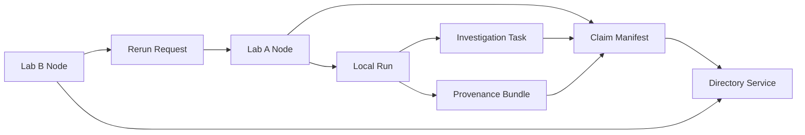

# LabLinks PoC

LabLinks is lab-to-lab AI agent infrastructure for coordinating scientific work through claim objects, reruns, provenance, and contradiction handling without centralizing raw data.

This repository is a reference proof-of-concept for the core LabLinks primitive: a claim object represented as a Claim Manifest, discovered through a shared directory, rerun under local policy, returned with provenance, and escalated into a structured investigation task when the rerun conflicts with the published claim.

Raw data and local execution remain inside each lab node. Only approved outputs and provenance leave the node.

## What this proves

- policy-aware rerun requests are evaluated locally at the lab node
- execution stays local and only approved summary outputs leave the node
- provenance ties together claim version, request, policy decision, and execution template digests
- contradictions are represented as first-class scientific events
- contradiction handling flows back into the claim object and spawns a richer investigation task

## What this repo demonstrates

- Lab A publishes a claim manifest.
- A shared directory indexes and exposes it for discovery.
- Lab B discovers the claim and submits a rerun request.
- Lab A evaluates local policy, executes locally, and releases only approved summary outputs.
- A conflicting rerun is represented explicitly and creates a follow-up investigation task.
- A denied raw-data request and a review-gated artifact request prove the governance layer is real.

## Why this matters

**LabLinks turns cross-lab scientific coordination from ad hoc human workflow into structured, policy-aware, provenance-backed infrastructure for AI agents and labs.**

## Architecture



- `directory/`: FastAPI discovery service for published claim manifests.
- `lab_a_node/` and `lab_b_node/`: reusable lab-node app launched with separate configs and local SQLite state.
- `sdk/`: minimal Python client for publishing claims, discovering claims, submitting reruns, and fetching results plus provenance.
- `demo/`: runnable scripts for the core cross-lab flow, within-lab coordination, denied-policy controls, and the combined scenario.
- `examples/`: sample JSON payloads for the primary public objects, including a clean seeded claim and a post-contradiction claim.

Claim object vs Claim Manifest:
the claim object is the conceptual coordination unit; the Claim Manifest is its machine-readable JSON representation in this PoC.

## Quickstart

```bash
python3 -m venv .venv
. .venv/bin/activate
pip install -e .[dev]
docker compose up --build -d
```

Check service health:

```bash
curl http://localhost:8000/health
curl http://localhost:8001/health
curl http://localhost:8002/health
```

## Run the demos

Core cross-lab loop:

```bash
python -m demo.demo_core_flow
```

Within-lab coordination:

```bash
python -m demo.demo_within_lab
```

Policy controls:

```bash
python -m demo.demo_policy_controls
```

Combined within-lab and across-lab coordination:

```bash
python -m demo.demo_cross_lab_agents
```

Reset the demo state if you want to replay from a clean published claim:

```bash
curl -X POST http://localhost:8000/demo/reset
curl -X POST http://localhost:8001/demo/reset
curl -X POST http://localhost:8002/demo/reset
```

All demo scripts call those reset endpoints automatically before they start, so Demo 1 begins from a clean `published` claim rather than a previously contradicted state.

## Example flow

1. `GET /claims/{claim_id}` on Lab A fetches the local Claim Manifest.
2. `POST /claims` publishes that manifest to the directory.
3. `POST /requests` submits a rerun request from Lab B to Lab A.
4. `POST /runs` executes the approved request inside Lab A.
5. `GET /runs/{run_id}/result` and `GET /runs/{run_id}/provenance` return approved outputs.
6. `GET /claims/{claim_id}` after the run shows the claim moved into `under_investigation` with linked contradiction and task state.
7. `GET /investigation-tasks/{task_id}` shows the automatically spawned follow-up task when divergence crosses the configured threshold.

Sample payloads:

- `examples/claim.json` is the clean seeded claim used at demo start.
- `examples/claim_after_contradiction.json` is the same claim after the cross-lab contradiction flow.

## Intentional non-goals

- polished product UI
- enterprise auth and tenancy
- robotics integration
- broad ontology design
- embeddings-heavy discovery
- production-scale infrastructure
